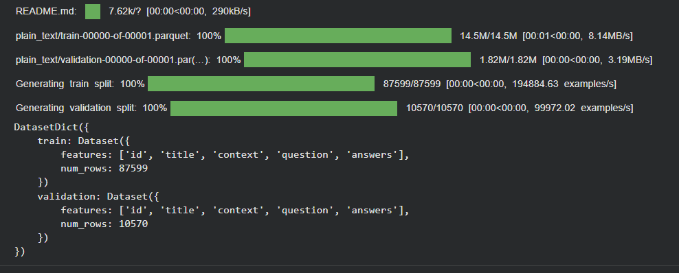
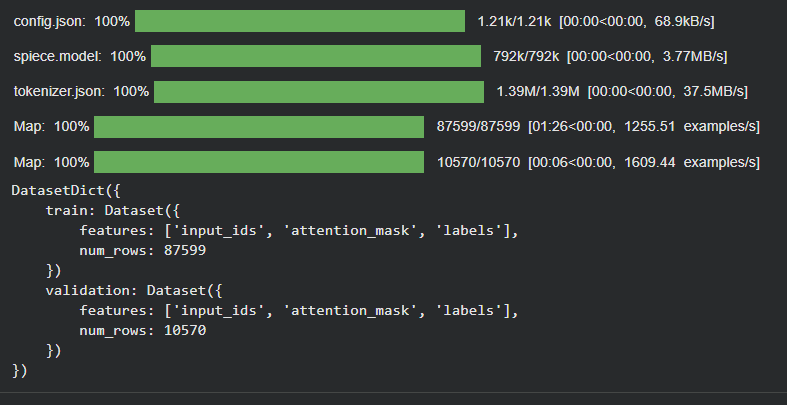
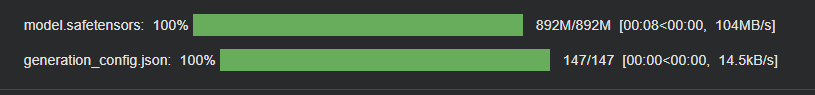
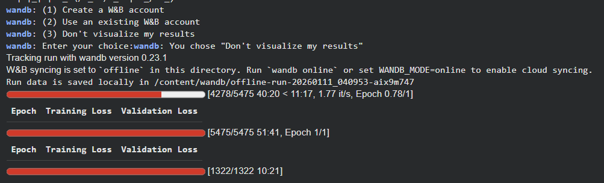

# Laporan Eksperimen SQuAD (Question Answering)

## 1. Pendahuluan
Eksperimen ini dilakukan untuk memenuhi tugas Ujian Akhir Semester (UAS)
mata kuliah Deep Learning. Fokus dari eksperimen ini adalah penerapan
model Deep Learning untuk tugas **Question Answering (QA)** menggunakan
dataset SQuAD (Stanford Question Answering Dataset).

Tugas Question Answering bertujuan untuk menghasilkan jawaban yang tepat
berdasarkan sebuah pertanyaan dan konteks teks yang diberikan.

---

## 2. Dataset SQuAD

Dataset SQuAD dimuat menggunakan library HuggingFace Datasets.
Dataset ini terdiri dari pasangan *question* dan *context* yang disertai
dengan jawaban yang terdapat di dalam konteks.

Dataset dibagi menjadi data latih (train) dan data validasi untuk
mendukung proses pelatihan dan pemantauan performa model.

---

## 3. Preprocessing Dataset

Sebelum dilakukan tokenisasi, dataset SQuAD melalui tahap preprocessing
untuk menyesuaikan format data Question Answering. Tahap ini meliputi
penyusunan pasangan pertanyaan dan konteks serta penyesuaian posisi
jawaban dalam teks.

Preprocessing bertujuan untuk memastikan data Question Answering dapat
diproses dengan baik oleh model Deep Learning.

---

## 4. Tokenisasi dan Encoding

Setelah preprocessing, data Question Answering melalui proses tokenisasi
menggunakan tokenizer dari model Transformer.

Proses tokenisasi menghasilkan representasi input berupa `input_ids`,
`attention_mask`, serta informasi posisi awal dan akhir jawaban yang
digunakan sebagai masukan bagi model.

---

## 5. Model Deep Learning

Model yang digunakan dalam eksperimen ini adalah model Transformer
berbasis BERT atau DistilBERT yang dirancang khusus untuk tugas
Question Answering.

Model diinisialisasi dari pretrained model sebelum dilakukan pelatihan.

---

## 6. Proses Pelatihan Model

Gambar berikut menunjukkan proses pelatihan model SQuAD selama beberapa
epoch. Selama proses ini, dicatat nilai training loss dan validation loss
sebagai indikator pembelajaran model.

Pemantauan performa pada data validasi dilakukan untuk memastikan model
mampu memahami hubungan antara pertanyaan dan konteks teks.

---

## 7. Kesimpulan

Berdasarkan hasil eksperimen, dapat disimpulkan bahwa model Deep Learning
berbasis Transformer mampu digunakan untuk tugas Question Answering pada
dataset SQuAD.

Eksperimen ini menunjukkan bahwa pendekatan Deep Learning efektif dalam
mengekstraksi jawaban yang relevan dari konteks teks berdasarkan
pertanyaan yang diberikan.
