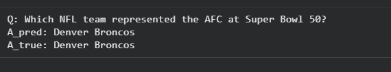

# Laporan Eksperimen SQuAD (Question Answering)

## 1. Pendahuluan
Eksperimen ini dilakukan untuk memenuhi tugas Ujian Akhir Semester (UAS)
mata kuliah Deep Learning. Fokus dari eksperimen ini adalah penerapan
model Deep Learning untuk tugas **Question Answering (QA)** menggunakan
dataset **SQuAD (Stanford Question Answering Dataset)**.

Tugas Question Answering bertujuan untuk menghasilkan jawaban yang tepat
berdasarkan sebuah pertanyaan dan konteks teks yang diberikan.

---

## 2. Dataset SQuAD

Dataset SQuAD dimuat menggunakan library HuggingFace Datasets.
Dataset ini terdiri dari data teks berupa *context*, *question*, dan
*answer* yang digunakan sebagai dasar pelatihan model Question Answering.

Dataset dibagi menjadi data latih (train) dan data validasi untuk
mendukung proses pelatihan dan pemantauan performa model.

---

## 3. Tokenisasi dan Encoding

Sebelum digunakan dalam pelatihan model, data Question Answering melalui
proses tokenisasi menggunakan tokenizer dari model Transformer.
Proses ini mengubah teks pertanyaan dan konteks menjadi representasi
numerik yang dapat diproses oleh model.

Hasil tokenisasi menghasilkan `input_ids` dan `attention_mask` yang
digunakan sebagai input utama bagi model Deep Learning.

---

## 4. Model Deep Learning

Model yang digunakan dalam eksperimen ini adalah model Transformer
berbasis DistilBERT yang dirancang khusus untuk tugas Question Answering.
Model diinisialisasi dari pretrained model sebelum dilakukan pelatihan.

---

## 5. Proses Pelatihan Model

Gambar berikut menunjukkan proses pelatihan model SQuAD selama beberapa
epoch. Pada setiap epoch dicatat nilai training loss dan validation loss
sebagai indikator proses pembelajaran model.

Pemantauan loss selama pelatihan digunakan untuk memastikan model mampu
belajar memahami hubungan antara pertanyaan dan konteks teks.

---

## 6. Inferensi Model

Setelah proses pelatihan selesai, model digunakan untuk melakukan
inferensi atau prediksi jawaban terhadap contoh pertanyaan.
Proses inferensi ini menunjukkan kemampuan model dalam menghasilkan
jawaban yang relevan dari konteks yang diberikan.

Hasil inferensi menunjukkan bahwa model mampu menghasilkan jawaban yang
sesuai dengan jawaban yang diharapkan.

---

## 7. Kesimpulan

Berdasarkan hasil eksperimen, dapat disimpulkan bahwa model Deep Learning
berbasis Transformer mampu digunakan untuk tugas Question Answering pada
dataset SQuAD.

Eksperimen ini menunjukkan bahwa pendekatan Deep Learning efektif dalam
menjawab pertanyaan berdasarkan konteks teks secara otomatis.
