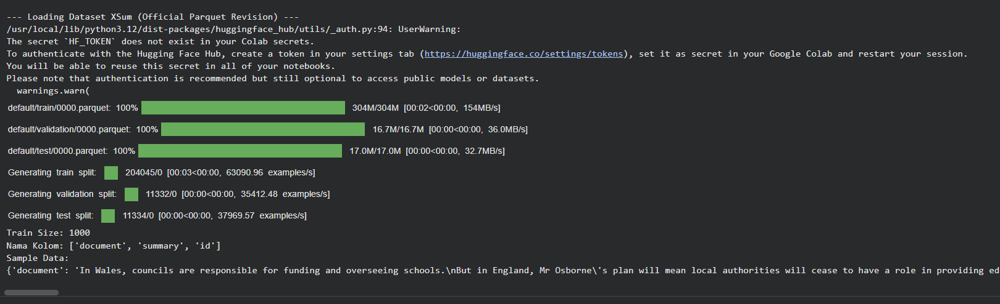
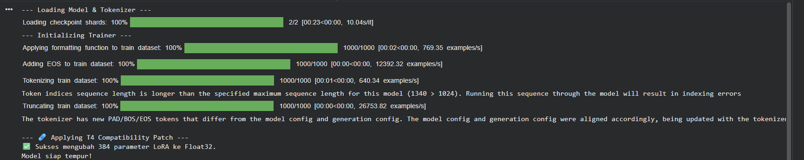
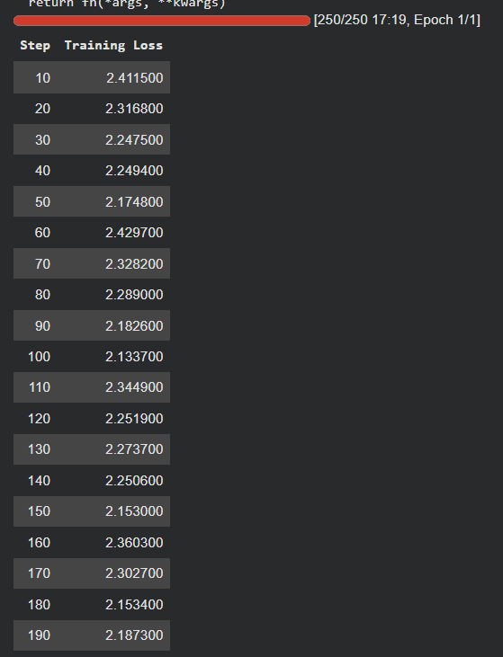
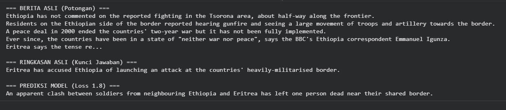

# Laporan Eksperimen XSum (Text Summarization)

## 1. Pendahuluan
Eksperimen ini dilakukan untuk memenuhi tugas Ujian Akhir Semester (UAS)
mata kuliah Deep Learning. Fokus dari eksperimen ini adalah penerapan
model Deep Learning untuk tugas **Text Summarization** menggunakan
dataset **XSum**.

Text summarization bertujuan untuk menghasilkan ringkasan singkat
yang tetap mempertahankan informasi penting dari teks berita asli.

---

## 2. Dataset XSum

Dataset XSum dimuat menggunakan library HuggingFace Datasets.
Dataset ini terdiri dari teks artikel berita (*document*) dan ringkasan
singkat (*summary*) yang bersifat abstractive.

Dataset dibagi menjadi data latih dan data validasi untuk mendukung
proses pelatihan dan pemantauan performa model.

---

## 3. Tokenisasi dan Encoding

Sebelum digunakan dalam pelatihan model, teks artikel pada dataset XSum
melalui proses tokenisasi menggunakan tokenizer dari model Transformer.
Pada tahap ini juga dilakukan penyesuaian panjang sekuens agar sesuai
dengan batas maksimum model.

Proses tokenisasi mengubah teks menjadi representasi numerik berupa
`input_ids` dan `attention_mask` yang dapat diproses oleh model
Deep Learning.

---

## 4. Proses Pelatihan Model

Gambar berikut menunjukkan proses pelatihan model XSum selama satu epoch.
Selama proses pelatihan, nilai training loss dicatat sebagai indikator
pembelajaran model.

Nilai loss yang tercatat menunjukkan bahwa model mulai mempelajari pola
perangkum teks dari data latih.

---

## 5. Inferensi Model

Setelah proses pelatihan selesai, model digunakan untuk melakukan
inferensi atau menghasilkan ringkasan teks dari artikel berita.
Hasil inferensi dibandingkan dengan ringkasan asli untuk melihat
kemampuan model dalam menghasilkan ringkasan.

Hasil inferensi menunjukkan bahwa model mampu menghasilkan ringkasan
yang lebih singkat dan relevan terhadap isi teks.

---

## 6. Kesimpulan

Berdasarkan hasil eksperimen, dapat disimpulkan bahwa model Deep Learning
berbasis Transformer mampu digunakan untuk tugas text summarization
menggunakan dataset XSum.

Eksperimen ini menunjukkan bahwa pendekatan Deep Learning efektif dalam
menghasilkan ringkasan teks berita secara otomatis.
