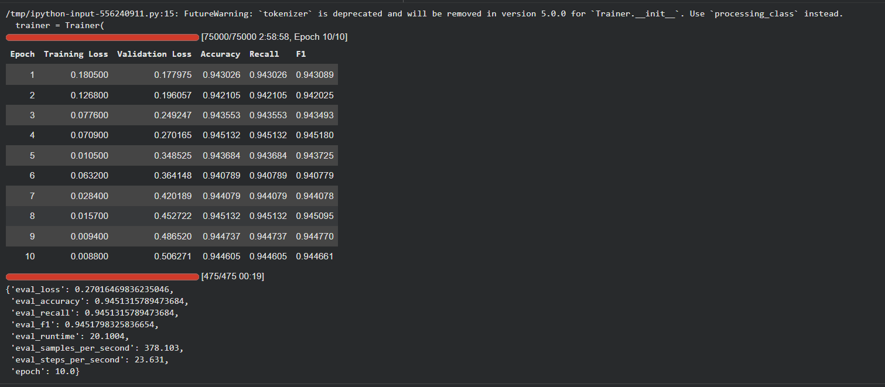
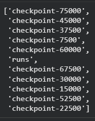
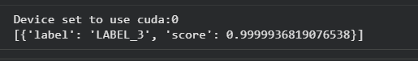

# Laporan Eksperimen AG News

## 1. Pendahuluan
Eksperimen ini dilakukan untuk memenuhi tugas Ujian Akhir Semester (UAS)
mata kuliah Deep Learning. Tujuan dari eksperimen ini adalah melakukan
klasifikasi topik berita menggunakan dataset AG News dengan pendekatan
Deep Learning.

Dataset AG News terdiri dari artikel berita yang dikelompokkan ke dalam
empat kategori utama, yaitu World, Sports, Business, dan Sci/Tech.

---

## 2. Dataset
Dataset AG News dimuat menggunakan library HuggingFace Datasets.
Setiap data berisi teks berita dan label kategori yang sesuai.

Dataset ini digunakan untuk melatih dan mengevaluasi model Deep Learning
dalam tugas klasifikasi teks multi-kelas.

---

## 3. Proses Pelatihan Model

Gambar berikut menunjukkan proses pelatihan dan validasi model selama
10 epoch. Pada setiap epoch dicatat nilai training loss, validation loss,
accuracy, recall, dan F1-score.

Berdasarkan hasil pelatihan, terlihat bahwa model mampu mencapai nilai
akurasi dan F1-score yang tinggi dan relatif stabil di setiap epoch.

---

## 4. Hasil Evaluasi Model

Setelah proses pelatihan selesai, model dievaluasi menggunakan data uji.
Hasil evaluasi akhir ditunjukkan pada gambar berikut.

Model mencapai nilai akurasi dan F1-score sekitar 94,5%, yang menunjukkan
bahwa model memiliki performa yang baik dalam mengklasifikasikan topik berita.

---

## 5. Checkpoint Model

Selama proses pelatihan, model disimpan secara berkala dalam bentuk checkpoint.
Checkpoint ini berguna untuk melakukan penyimpanan model dan memungkinkan
pelatihan dilanjutkan kembali jika diperlukan.

---

## 6. Inferensi Model

Model yang telah dilatih kemudian digunakan untuk melakukan inferensi
atau prediksi terhadap contoh teks berita. Proses inferensi dilakukan
menggunakan GPU untuk mempercepat komputasi.

Hasil inferensi menunjukkan bahwa model mampu memprediksi kelas berita
dengan tingkat kepercayaan yang sangat tinggi.

---

## 7. Kesimpulan
Berdasarkan hasil eksperimen, dapat disimpulkan bahwa model Deep Learning
yang digunakan mampu melakukan klasifikasi topik berita pada dataset AG News
dengan performa yang sangat baik.

Eksperimen ini menunjukkan efektivitas pendekatan Deep Learning dalam
tugas pemrosesan bahasa alami, khususnya klasifikasi teks.
