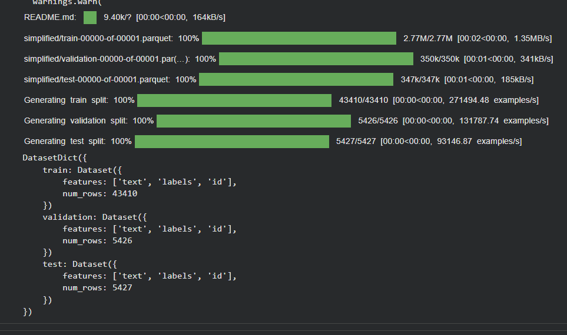
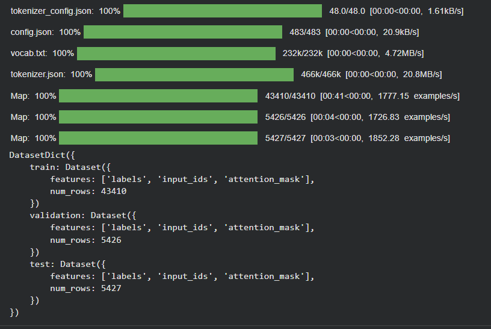
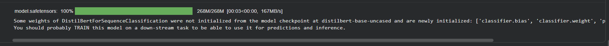
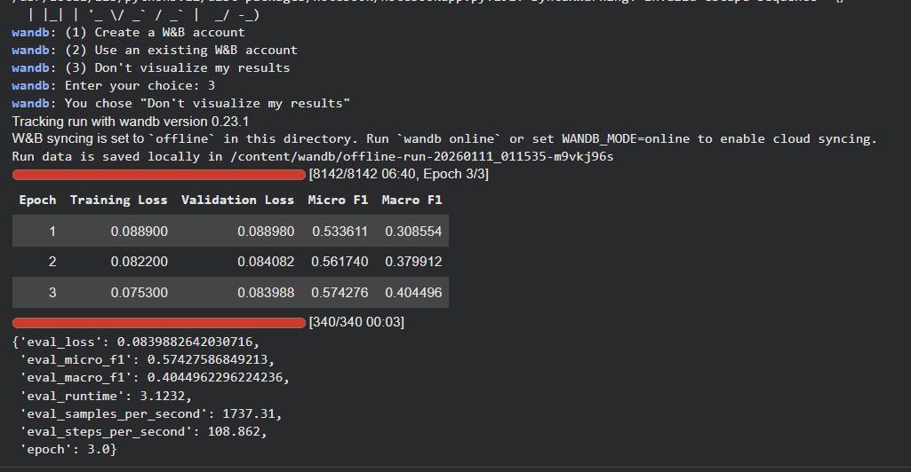

# Laporan Eksperimen GoEmotions

## 1. Pendahuluan
Eksperimen ini dilakukan untuk memenuhi tugas Ujian Akhir Semester (UAS)
mata kuliah Deep Learning. Fokus dari eksperimen ini adalah melakukan
klasifikasi emosi pada teks menggunakan dataset GoEmotions dengan
pendekatan Deep Learning.

GoEmotions merupakan dataset multi-label, di mana satu teks dapat
memiliki lebih dari satu label emosi.

---

## 2. Dataset GoEmotions

Dataset GoEmotions dimuat menggunakan library HuggingFace Datasets.
Dataset ini dibagi menjadi tiga bagian, yaitu data latih (train),
data validasi (validation), dan data uji (test).

Pembagian dataset ini bertujuan untuk memastikan proses pelatihan
dan pemantauan performa model dapat dilakukan secara terstruktur.

---

## 3. Preprocessing dan Tokenisasi

Sebelum digunakan dalam pelatihan model, data teks melalui tahap
tokenisasi menggunakan tokenizer dari model Transformer.
Proses ini menghasilkan representasi input berupa `input_ids`
dan `attention_mask`.

Tahap preprocessing ini sangat penting untuk memastikan data
dapat diproses oleh model Deep Learning berbasis Transformer.

---

## 4. Model Deep Learning

Model yang digunakan dalam eksperimen ini adalah model Transformer
berbasis DistilBERT untuk tugas klasifikasi sekuens teks multi-label.
Model diinisialisasi dari pretrained model dan kemudian dilatih
menggunakan dataset GoEmotions.

---

## 5. Proses Pelatihan Model

Gambar berikut menunjukkan proses pelatihan model selama 3 epoch.
Pada setiap epoch dicatat nilai training loss serta metrik
pemantauan performa berupa Micro F1 dan Macro F1 pada data validasi.

Hasil pelatihan menunjukkan bahwa nilai loss menurun seiring
bertambahnya epoch, sementara nilai Micro F1 dan Macro F1
mengalami peningkatan, yang menandakan proses pembelajaran
model berjalan dengan baik.

---

## 6. Kesimpulan

Berdasarkan hasil eksperimen, dapat disimpulkan bahwa model
Deep Learning berbasis Transformer mampu mempelajari pola emosi
pada teks menggunakan dataset GoEmotions.

Eksperimen ini menunjukkan bahwa pendekatan Deep Learning
dapat digunakan secara efektif untuk tugas klasifikasi emosi
multi-label pada data teks.
