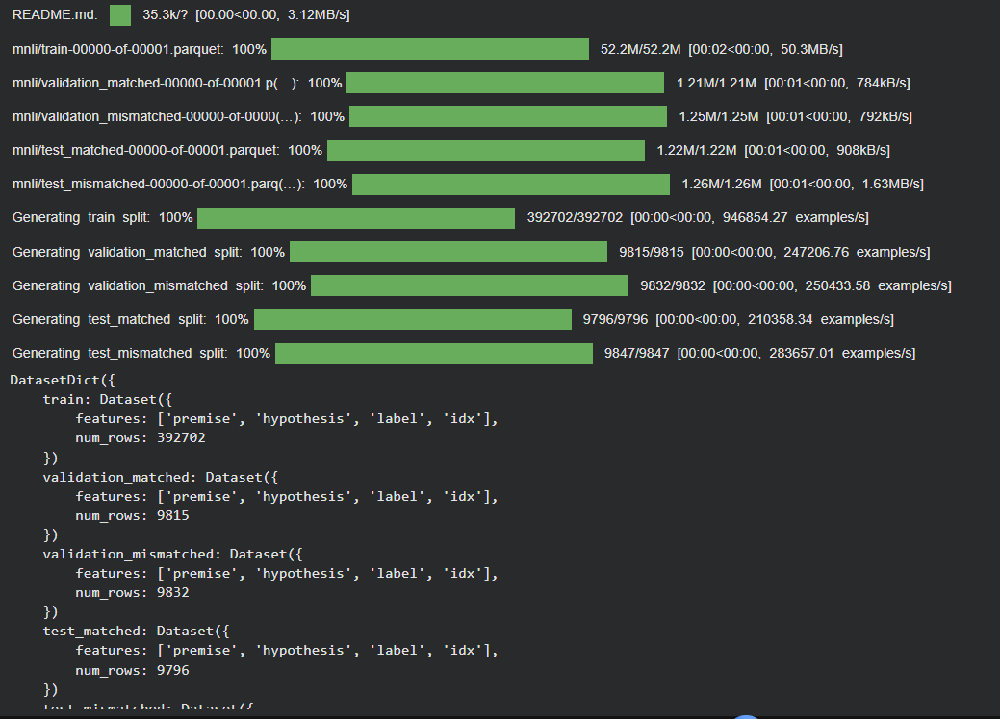
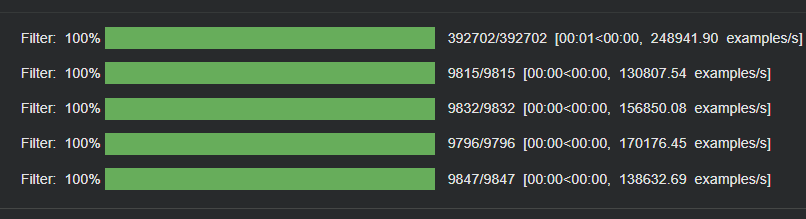
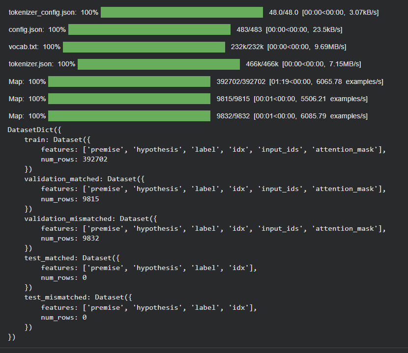
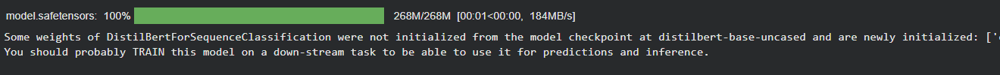
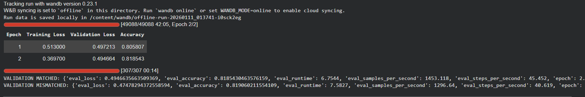

# Laporan Eksperimen MNLI (Multi-Genre Natural Language Inference)

## 1. Pendahuluan
Eksperimen ini dilakukan untuk memenuhi tugas Ujian Akhir Semester (UAS)
mata kuliah Deep Learning. Fokus dari eksperimen ini adalah penerapan
model Deep Learning untuk tugas **Natural Language Inference (NLI)**
menggunakan dataset MNLI (Multi-Genre Natural Language Inference).

Tugas NLI bertujuan untuk menentukan hubungan semantik antara dua kalimat,
yaitu apakah kalimat kedua bersifat entailment, contradiction, atau
neutral terhadap kalimat pertama.

---

## 2. Dataset MNLI

Dataset MNLI dimuat menggunakan library HuggingFace Datasets melalui
benchmark GLUE. Dataset ini terdiri dari pasangan kalimat berupa
*premise* dan *hypothesis* yang berasal dari berbagai genre teks.

Dataset dibagi ke dalam beberapa subset, yaitu data latih (train),
validation matched, validation mismatched, serta test set. Pembagian ini
digunakan untuk mendukung proses pelatihan dan pemantauan performa model.

---

## 3. Preprocessing Dataset

Sebelum dilakukan tokenisasi, dataset MNLI melalui tahap preprocessing
berupa penyaringan data (filtering). Tahap ini bertujuan untuk memastikan
data yang digunakan sesuai dengan kebutuhan eksperimen.

Preprocessing dilakukan untuk menjaga kualitas data sebelum masuk ke
tahap selanjutnya.

---

## 4. Tokenisasi dan Encoding

Setelah preprocessing, pasangan kalimat pada dataset MNLI melalui proses
tokenisasi dan encoding menggunakan tokenizer dari model Transformer.

Proses tokenisasi menghasilkan representasi input berupa `input_ids`
dan `attention_mask`, yang digunakan sebagai masukan bagi model
Deep Learning.

---

## 5. Model Deep Learning

Model yang digunakan dalam eksperimen ini adalah model Transformer
berbasis DistilBERT untuk tugas klasifikasi sekuens. Model diinisialisasi
dari pretrained model dan disesuaikan untuk tugas Natural Language
Inference.

---

## 6. Proses Pelatihan Model

Gambar berikut menunjukkan proses pelatihan model MNLI selama beberapa
epoch. Pada setiap epoch dicatat nilai training loss serta metrik
pemantauan performa pada data validasi.

Selain training loss, performa model juga dipantau menggunakan data
validation matched dan validation mismatched untuk mengamati kemampuan
model dalam menangani berbagai genre teks.

---

## 7. Kesimpulan

Berdasarkan hasil eksperimen, dapat disimpulkan bahwa model Deep Learning
berbasis Transformer mampu mempelajari hubungan semantik antar pasangan
kalimat pada dataset MNLI.

Eksperimen ini menunjukkan bahwa pendekatan Deep Learning efektif untuk
tugas Natural Language Inference pada data teks multi-genre.
